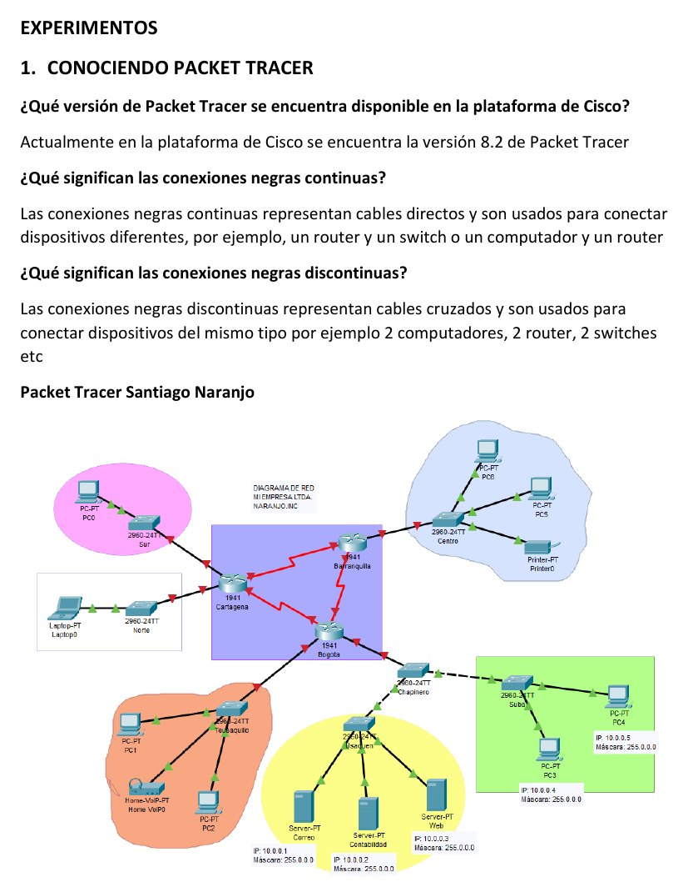
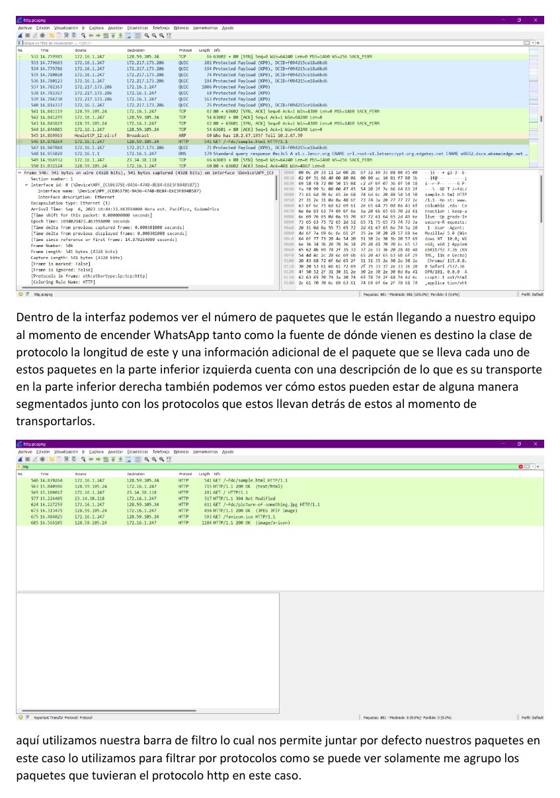
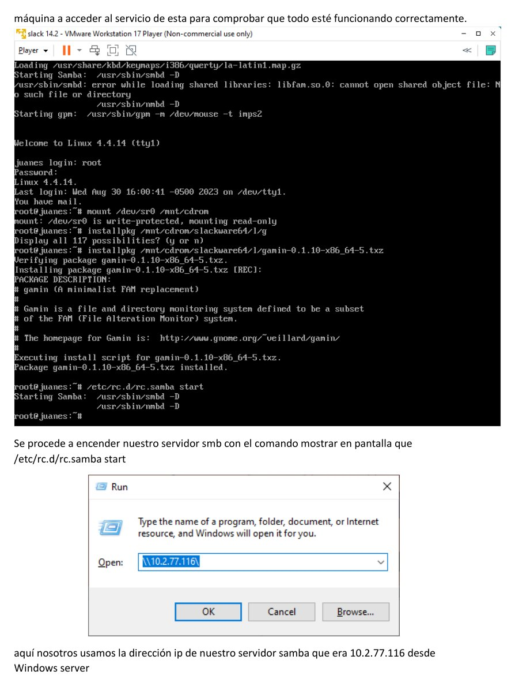

# Laboratorio 2 - Packet Tracer, Wireshark, `vi` y Samba

**Autores:** Juan Esteban Ortiz Pastrana y Santiago Alberto Naranjo Abril  
**Institución:** Escuela Colombiana de Ingeniería Julio Garavito  
**Grupo:** 2  
**Fecha:** 26 de agosto de 2023

## Objetivo

Relacionar la simulación de redes con el análisis de tráfico real y complementar la práctica con herramientas de administración Unix: editor `vi`, scripts y recursos compartidos mediante Samba.

## Componentes del laboratorio

| Componente | Actividad |
| --- | --- |
| Packet Tracer 8.2 | Construcción de topologías, conectividad y seguimiento de PDU |
| Wireshark | Captura, filtrado e inspección de protocolos |
| Editor `vi` | Inserción, búsqueda, sustitución, eliminación y guardado |
| Máquinas virtuales | Duplicación de Slackware, Solaris y Windows Server |
| Samba | Configuración de cliente, servidor, usuarios y carpetas compartidas |
| Scripts | Automatización en PowerShell y shell de Unix |

## Cisco Packet Tracer

El informe diferencia las conexiones continuas para dispositivos de distinto tipo y las conexiones discontinuas para enlaces cruzados. La topología de Santiago integra routers, switches, equipos y servidores en varios segmentos.



En modo simulación se realizaron pruebas con `ping` y se siguió el recorrido de los paquetes. La inspección de PDU permitió observar cómo cada capa agrega encabezados e información de control antes de transmitir los datos.

## Análisis con Wireshark

La interfaz se utilizó en modo promiscuo para capturar tráfico y revisar:

- Origen y destino.
- Tipo de protocolo.
- Longitud y encapsulamiento.
- Segmentación.
- Contenido asociado a las capas.

Los filtros facilitaron aislar tráfico HTTP y seleccionar paquetes específicos para su análisis.



El repositorio conserva `http.pcapng`, que permite volver a inspeccionar la captura.

## Editor `vi`

Se practicaron operaciones de edición sin depender de una interfaz gráfica:

```text
i / a / o      insertar texto
u              deshacer
/palabra       buscar hacia adelante
:set number    mostrar números de línea
:w             guardar
:q!            salir sin guardar
:wq            guardar y salir
```

También se utilizaron sustituciones globales, eliminación de palabras y rangos de líneas, navegación directa y recuperación de cambios no guardados.

## Samba

### Preparación

1. Montaje de la ISO de Slackware.
2. Instalación de Samba y Vim.
3. Copia del archivo de ejemplo `smb.conf`.
4. Instalación de dependencias requeridas.

### Servidor

Se creó el usuario `terry`, se definió un grupo de trabajo y se publicó el directorio `carpeta acceso`. El servicio se inició desde Slackware y se comprobó desde Windows Server mediante dirección IP y credenciales.



Las pruebas verificaron el acceso al directorio, la lectura del archivo de prueba y la conexión desde Slackware. En Solaris fue necesario instalar Samba manualmente antes de usar `smbclient`.

## Automatización

Los scripts incluidos permiten trabajar con usuarios, grupos, logs y visualización de información tanto en PowerShell como en shell:

- `Logs.ps1`
- `Visualizacion.ps1`
- `Visualizacion.sh`
- `grupos.sh`
- `lab02.sh`
- `listar.ps1`
- `usuarios.sh`

## Resultados

Se comprobó que la simulación permite estudiar el flujo de paquetes antes de trabajar sobre una red real. Wireshark hizo visible la estructura del tráfico, mientras que `vi`, los scripts y Samba permitieron practicar administración y transferencia de archivos entre sistemas heterogéneos.

## Informe y evidencias

- [Informe completo en PDF](laboratorio-02-packet-tracer-wireshark-y-samba.pdf)
- `Laboratorio No 2.docx`
- `http.pcapng`
- Videos explicativos y scripts
